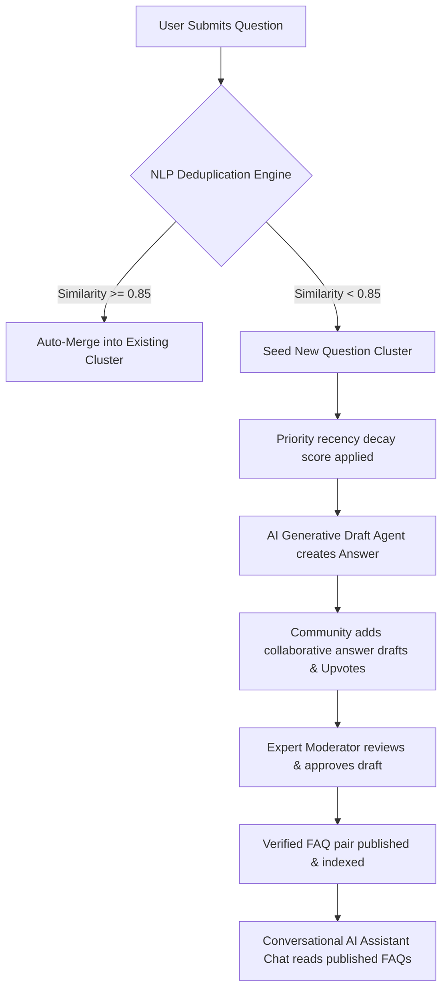

# 🌟 Crowd-Sourced FAQ Generation & Management System
> An enterprise-grade, collaborative knowledge pipeline that harnesses collective community feedback to automatically deduplicate, prioritize, draft, and curate high-quality Frequently Asked Questions (FAQs).

---

## 📖 Project Overview & Abstract

Traditional, static FAQ pages fail to scale. They quickly become outdated, require significant administrative overhead, and do not adapt to real-time user needs. The **Crowd-Sourced FAQ Generation & Management System** solves this issue by creating an automated, intelligent, collaborative knowledge pipeline. 

By combining crowd-sourced curation (Quora-style upvoting and community drafting) with automated Natural Language Processing (NLP) deduplication and Generative AI agents, the system captures user search patterns, resolves duplicate questions, drafts instant resolutions, and offers a conversational chat-style Q&A assistant to support fast customer self-service.



---

## 📂 System Folder Directory Structure

To support rapid, isolated deployment across full-stack modules, the codebase is structured into cohesive folders:

```bash
├── 📁 frontend/             # React.js SPA Client (Vite + Tailwind CSS + Lucide Icons)
│   ├── 📁 src/
│   │   ├── 📄 App.jsx       # Multi-Portal Workspace, AI Chat, Curation, Diagnostics, & Logs
│   │   ├── 📄 index.css     # Glassmorphic UI styling tokens & transitions
│   │   └── 📄 main.jsx      # React entrypoint
│   ├── 📄 index.html        # SPA template wrapper
│   ├── 📄 package.json      # React dependencies
│   ├── 📄 tailwind.config.js# Custom branding configurations
│   └── 📄 postcss.config.js # CSS post-compiler config
├── 📁 backend/              # Node.js Express REST API (Business logic & persistence SQLite)
│   ├── 📄 server.js         # API handlers, priority calculations, database schema definitions
│   └── 📄 package.json      # Backend modules
├── 📁 nlp-service/          # Python AI/NLP Service (Embeddings & Prompt Customizers)
│   ├── 📄 app.py            # Sentence-Transformers API & similarity endpoints
│   └── 📄 requirements.txt  # Python requirements (Flask, sentence-transformers, PyTorch)
├── 📁 docs/                 # Team Lead & Architecture Documentation
│   ├── 📄 api_contract.md   # Unified REST interface schema contract
│   ├── 📄 architecture.md   # Database schemas, Mermaid state transitions, and math
│   ├── 📄 demo_script.md    # 10-Step video demonstration and presentation walkthrough
│   └── 📄 CrowdFAQ_ProjectDocument.pdf # Original full project sprint specifications
├── 📄 integration_test.py   # Complete end-to-end Python pipeline simulator
└── 📄 README.md             # Stunning main index (This file)
```

---

## ⚙️ The 6-Stage NLP Knowledge Pipeline & Deep Insights

Under the hood, the system coordinates six distinct functional stages to process, prioritize, and distribute verified knowledge.

### 1. Question Submission
Users input questions through a unified interface. The system captures the author, selected category tag (General, Account Security, Billing, Technical Support, Community Policies), and the query string.

### 2. Semantic Deduplication Routing
To prevent duplicate questions from cluttering community feeds, questions are analyzed in real-time. The system calculates cosine similarity against existing open clusters.
*   **Cosine Similarity Equation**:
    $$\text{Cosine Similarity} = \frac{\mathbf{A} \cdot \mathbf{B}}{\|\mathbf{A}\| \|\mathbf{B}\|}$$
*   **Routing Logic**: If the calculated similarity exceeds the threshold (default `0.85`), the question is flagged as a duplicate and automatically merged into the matching cluster (incrementing its view count and community weight). Otherwise, it seeds a new unique cluster.

### 3. Recency Time-Decay Prioritization
To prevent early submissions from permanently blocking newly trending topics, the cluster prioritization queue dynamically sorts open questions using a Recency Time-Decay scoring formula:
*   **Decay Equation**:
    $$\text{Priority Score} = \frac{\text{Upvotes} + 1.0}{(\text{Hours Elapsed} + 2.0)^{\lambda}}$$
    Where $\lambda$ represents the customizable decay weight parameter (default `0.5`).
*   **Dynamic Bubbling**: Older clusters with few upvotes decay in priority, allowing new, high-demand topics to bubble to the top of the moderator's panel immediately.

### 4. Generative AI Curation Agent
Upon cluster initialization, the system triggers an automatic generative worker. Using custom prompt instructions and category classification, it drafts a concise, step-by-step response instantly. This ensures expert curators have a ready-made resolution template to edit rather than drafting responses from scratch.

### 5. Expert Moderator Curation
Curators access a password-protected moderation tower to finalize answers. 
*   **Human-in-the-Loop Curation**: The moderator can edit the AI-generated draft, review and select collaborative draft answers submitted by community contributors, or reject the topic entirely.
*   **Publishing**: Approving an answer updates the cluster status to `published` and commits the final question-answer pair to the verified FAQ database.

### 6. Conversational AI Q&A Assistant
Once published, verified FAQs are indexed. The chat assistant extracts verified knowledge using semantic mapping vectors to generate direct conversational answers, enabling automated self-service dialogue.

---

## 🖥️ Interactive Dashboards & Portal Modules

The application is structured into two main workspaces: the **User Q&A Portal** and the **Admin Control Tower**.

### 💼 User Q&A Portal
1.  **Verified FAQ Search Feed**: Instantly browse published knowledge categories, view read counts, and search answers using keyword indexing.
2.  **Conversational AI Q&A Assistant**: A dialogue-driven chat interface where users ask questions and get instant, context-aware answers generated from published FAQ pairs, complete with typing indicators.
3.  **Ask the Community & Live Deduplication Previewer**: As users type questions, a real-time NLP deduplication widget appears. It displays the similarity ratio of matching clusters, informing the user if their question has already been asked.
4.  **Priority Decay Voting Queue (Quora-Style)**: Users can filter questions by followed category tags, upvote topics of interest, inspect AI drafts, and submit collaborative answer drafts. Upvotes immediately recalculate priority scores.

### 🛡️ Admin Control Tower
> [!IMPORTANT]
> **Administrative Security Access**
> To unlock the moderation control tower and diagnostics, input the administrative passcode: **`admin`**.

5.  **Expert Curation Queue**: Moderators review pending clusters sorted by Priority Decay Scores. Clicking on a cluster reveals community-submitted drafts, allowing the moderator to select the best draft, edit it in the Curation Box, and publish it.
6.  **AI Prompt Customizer Playground**: Fine-tune the instructions guiding tomorrow's Generative AI draft generation engine. It includes a live configuration panel for **Similarity Thresholds**, **Decay Exponents**, and **LLM Temperature**.
7.  **Live Diagnostics & Activity Audit Logs**: Displays fluctuations in mock system CPU and RAM usage, alongside a database allocation summary (SQLite size, RAG state). The **System Activity Log** acts as a filterable, searchable audit monitor, logging every submission, upvote, merge, and sync.

---

## 🛠️ Step-by-Step Installation & Setup Guide

### 📋 Prerequisites
*   **Node.js**: v16 or higher (v18+ recommended)
*   **Python**: v3.10 or higher
*   **npm**: v9 or higher

---

### 1. React Frontend SPA Setup
Navigate to the client directory and start the Vite development server:
```bash
cd frontend
# Install Tailwind CSS and PostCSS dependencies
npm install

# Compile the base styling system and run the local development server
npm run dev
```
The React frontend is now accessible at `http://localhost:5173`. 
> [!TIP]
> **High-Fidelity Mock Simulator Active**
> When the backend REST API is offline, the React client automatically activates its **High-Fidelity Mock Database Simulator**. You can test question submission, Cosine Similarity matching, priority decay sorting, Upvoting, AI drafting, moderator publishing (with passcode `admin`), prompt editing, and activity log auditing directly in the browser with zero external services required!

---

### 2. Node.js Express REST API Backend Setup
To launch the persistence database and Express server:
```bash
cd backend
# Install dependencies (Express, SQLite3, Cors, Nodemon)
npm install

# Run the API server
npm run dev
```
The API backend starts at `http://localhost:5000`, connecting SQLite schemas to the client pipeline.

---

### 3. Python NLP Embeddings Service Setup
To launch the Sentence-Transformers cosine similarity server:
```bash
cd nlp-service
# Create and activate virtual environment (optional but recommended)
python -m venv venv
venv\Scripts\activate   # On Windows

# Install Sentence-Transformers, Flask, and PyTorch dependencies
pip install -r requirements.txt

# Run the similarity microservice
python app.py
```
The NLP embedding microservice boots up at `http://localhost:8000`, handling vector conversions using the `all-MiniLM-L6-v2` model.

---

### 4. Running the End-to-End CLI Pipeline Simulator
If you want to verify the database schemas, similarity calculations, time decay weights, prompt generators, and search indexing through a command-line interface:
```bash
# From the root directory, execute:
python integration_test.py
```
Follow the interactive CLI prompts to seed questions, observe similarity merges, upvote clusters, approve AI drafts, and run keywords searches!

---

## ⚙️ Advanced Features

The **Crowd-Sourced FAQ Generation & Management System** is equipped with several advanced enterprise-grade features:

### 1. Automated SQLite Failover & Backup Handling
To ensure high availability, the backend employs a multi-database fallback strategy. If a read/write operation on the primary database (`database.sqlite`) encounters errors (e.g., file corruption, I/O limits, or locking), the system automatically redirects incoming queries to a hot-backup database (`database_backup.sqlite`). 
*   **Failover Lifecycle**: The `FailoverDatabase` wrapper handles retry logic transparently, ensuring zero-downtime transition. The frontend displays the active database in the diagnostics view.

### 2. Points & Gamification Curation System
To motivate high-quality crowd-sourced contributions, users accumulate engagement points based on their behavior:
*   **Submitting a question**: `+10` points
*   **Merging duplicate questions**: `+5` points
*   **Upvoting a question/cluster**: `+1` point to the voter, `+5` points to the author of the question
*   **Moderator approves community answer**: `+100` points to the contributor
*   **Spam Penalty**: If a moderator marks a question/cluster as "useless" or spam, the system deletes it and applies a `-20` points deduction from the author's balance.

### 3. Emergency Tokens & Immediate Admin Notifications
When resolving critical issues, users can spend **Emergency Tokens** (each user starts with `3` tokens) to submit a priority request:
*   **Escalated Priority**: Using a token flags the question as an emergency. The priority scoring instantly shifts to the top of the queue.
*   **Admin Notification**: A real-time notification alert triggers in the Admin Control Tower immediately, allowing moderators to act without delay.

### 4. Community Answers & Peer Publishing
Any authenticated user can submit draft answers directly to unanswered questions:
*   **Peer Curation**: Community drafts can be upvoted or downvoted by others.
*   **Expert Approval**: The moderator reviews all community drafts side-by-side with AI drafts, edits the best response, and publishes it, rewarding the writer.

---
*Developed as an enterprise crowd-sourced knowledge management platform.*

