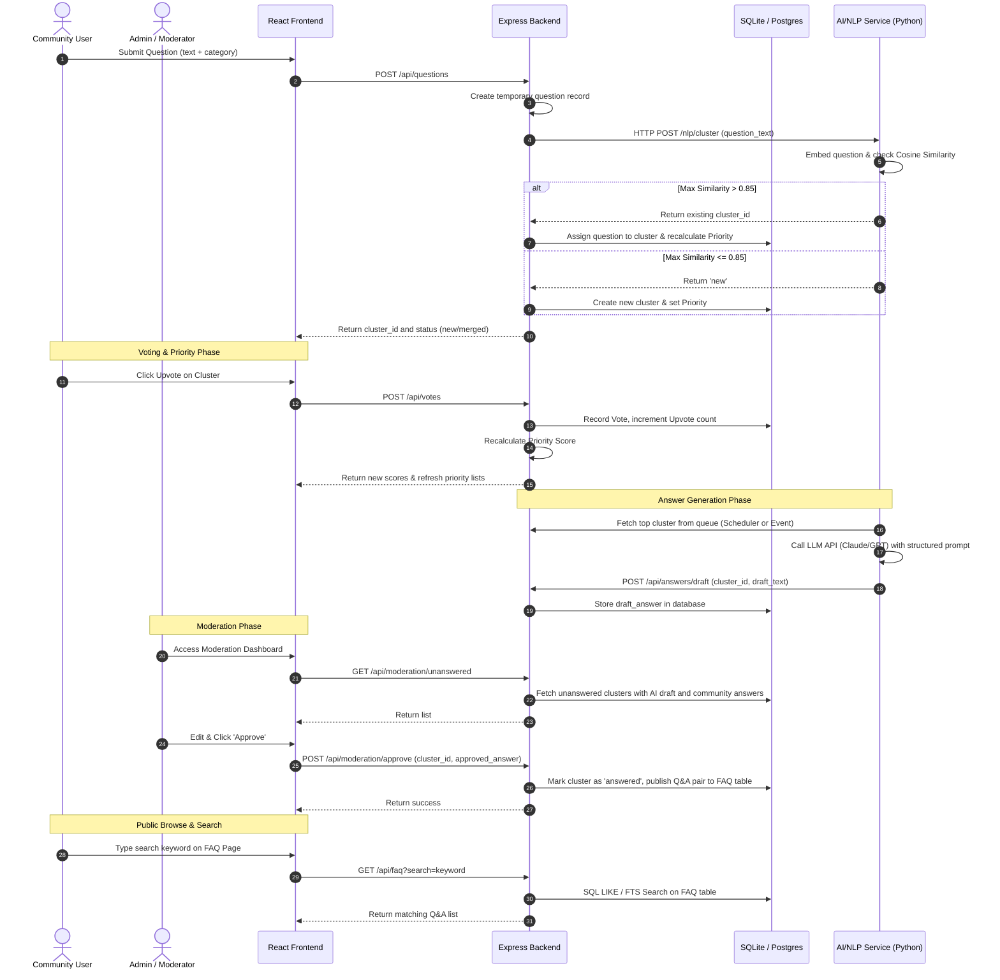
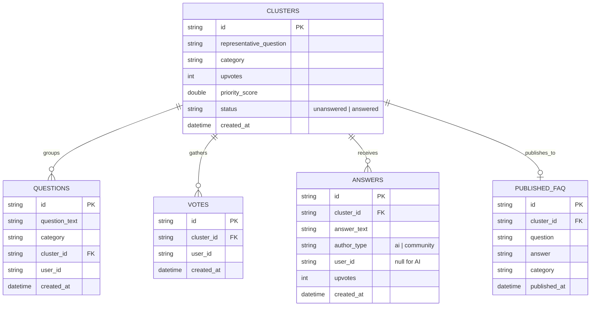

# Crowd-Sourced FAQ Generation System - Architecture & Pipeline Spec

This document details the system design, pipeline sequence flow, database schemas, and mathematical scoring rules for the project.

---

## 1. System Pipeline Overview

The system operates across six integrated stages:

---

## 2. Database Schema

The database can be modeled using SQLite or PostgreSQL. The MVP uses **SQLite** for rapid sprint deployment.

---

## 3. Mathematical & Algorithmic Rules

### A. Semantic Deduplication (NLP Layer)
1. **Sentence Embeddings**: The text of an incoming question $Q_{new}$ is converted to a vector $\vec{e}_{new}$ using a pre-trained sentence transformer (e.g., `all-MiniLM-L6-v2`).
2. **Cosine Similarity**: Compare $\vec{e}_{new}$ with the embeddings of all representative questions $\{\vec{e}_1, \vec{e}_2, ..., \vec{e}_N\}$ of active clusters:
   $$\text{Similarity}(Q_{new}, Q_i) = \frac{\vec{e}_{new} \cdot \vec{e}_i}{\|\vec{e}_{new}\| \|\vec{e}_i\|}$$
3. **Threshold Check**:
   * If $\max_i(\text{Similarity}(Q_{new}, Q_i)) > 0.85$, assign $Q_{new}$ to cluster $i$.
   * If $\max_i(\text{Similarity}(Q_{new}, Q_i)) \le 0.85$, create new cluster $C_{new}$ with representative question $Q_{new}$.

### B. Priority Scoring (Backend Layer)
To ensure relevant questions float to the top and old questions don't permanently clog the queue, the priority score $S$ is calculated using upvotes and recency decay:
$$S = \frac{\text{Upvotes} + 1}{(\Delta t_{\text{hours}} + 2)^{0.5}}$$
Where:
* $\text{Upvotes}$ is the total number of community votes.
* $\Delta t_{\text{hours}}$ is the duration in hours since the cluster was created:
  $$\Delta t_{\text{hours}} = \frac{T_{\text{current}} - T_{\text{creation}}}{3600 \text{ seconds}}$$

---

## 4. Technology Stack Mapping

* **Frontend**: React (Vite-scaffolded), Styled with Tailwind CSS, icons by Lucide-React.
* **Backend API**: Node.js with Express, data stored in SQLite.
* **NLP Service**: Python 3.10+, using standard NLP packages.
* **Integration File**: `integration_test.py` - handles mock simulations.
