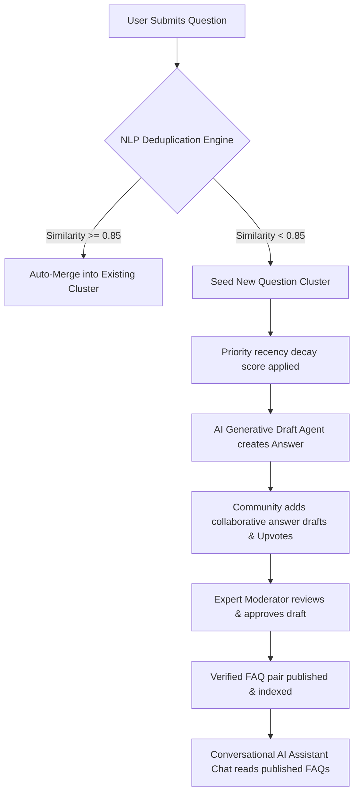

# Project Documentation: Crowd-Sourced FAQ Generation & Management System

This document outlines the goals, pipeline architecture, database schemas, and team structure of the **Crowd-Sourced FAQ Generation & Management System** as defined during the 3-day sprint.

---

## 1. Project Abstract & Overview

Traditional FAQ systems rely on static, manually written QA sets that quickly decay and fail to adapt to real-time community needs. The **Crowd-Sourced FAQ Generation & Management System** addresses this gap by creating an automated, intelligent, collaborative knowledge pipeline.

By combining crowd-sourced curation (Quora-style upvoting and community draft submissions) with Natural Language Processing (NLP) deduplication and Generative AI agents, the platform captures user search patterns, resolves duplicate questions, drafts instant resolutions, and offers a conversational chat-style Q&A assistant to support fast customer self-service.

---

## 2. Problem Statement

Organizations and platforms maintaining knowledge bases face three core challenges:
- **Static Content Decay**: FAQ pages are written once and rarely updated, leading to outdated, irrelevant information.
- **Scalability**: Human-only FAQ curation does not scale with the growth of user queries and product complexity.
- **Duplication & Noise**: User-submitted questions often repeat or vary slightly, making manual management inefficient.

This project proposes an automated, crowd-sourced pipeline that solves all three challenges simultaneously by making the FAQ a living, community-maintained document powered by AI.

---

## 3. The 6-Stage NLP Knowledge Pipeline

The system coordinates six distinct functional stages to process, prioritize, and distribute verified knowledge:

1. **Question Submission (Stage 1)**: Users submit questions via a clean, categorized form capturing the text, category tag, user identifier, and timestamp.
2. **Semantic Deduplication Routing (Stage 2)**: Every incoming question is passed through a sentence embedding model. Cosine similarity is computed against existing active clusters. If similarity > 0.85, the question is merged into an existing cluster; otherwise, it starts a new cluster.
3. **Recency Time-Decay Prioritization (Stage 3)**: Unanswered question clusters are ranked dynamically using a time-decay scoring formula to ensure trending topics bubble to the top:
   $$S = \frac{\text{Upvotes} + 1.0}{(\text{Hours Elapsed} + 2.0)^{0.5}}$$
4. **Generative AI Curation Agent (Stage 4)**: Upon cluster initialization, an automatic generative agent drafts a concise, step-by-step response instantly using an LLM.
5. **Expert Moderator Curation (Stage 5)**: Curators access a password-protected moderation dashboard to edit the AI-generated draft, review community-submitted drafts, and publish verified answers.
6. **Publish & Search (Stage 6)**: Approved FAQ entries are published to the public FAQ page, making them searchable via keyword matching and accessible to the conversational AI chat assistant.

---

## 4. Technology Stack Mapping

* **Frontend**: React.js (Vite) + Tailwind CSS + Lucide Icons
* **Backend API**: Node.js (Express)
* **Database**: SQLite (MVP persistence) with custom failover database support
* **NLP Service**: Python 3.10+ (Flask + Sentence-Transformers)
* **AI Draft Generation**: Google Gemini API / Grok API / Hugging Face Inference API

---

## 5. Team Structure & Responsibilities

The design, coding, testing, and deployment of the platform is led by:

| Team Member | Role | Module / Responsibilities |
|---|---|---|
| **Ganeshprabu BO** | Lead Architect & Developer | Full-stack architecture, Node.js failover database setup, React frontend dashboards, NLP pipeline integration, and gamification logic. |
